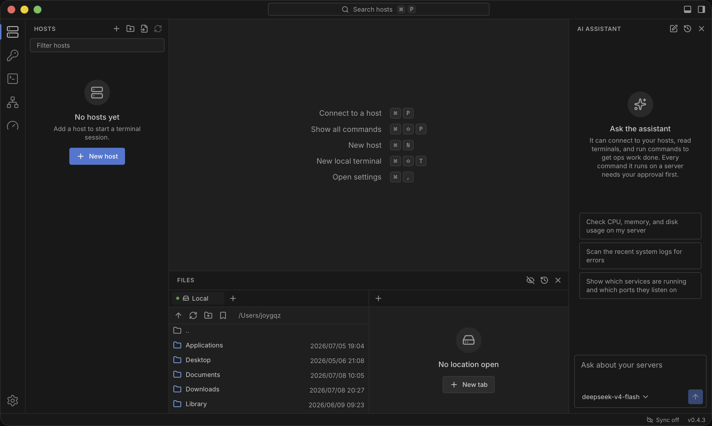

<div align="center">


# Sageport

**A modern SSH workbench — terminal, SFTP, key management, and an AI assistant in one desktop app**

[](https://github.com/joygqz/sageport/releases/latest)
[](LICENSE)
[](https://tauri.app)

[Download](https://github.com/joygqz/sageport/releases/latest) · [Highlights](#highlights) · [Features](#features) · [Quick start](#quick-start) · [Security](#security)

</div>

---



Sageport brings every tool of routine server work — terminal, file transfer, key management, monitoring, and command snippets — into a single VSCode-style desktop app. Everything lives in a local SQLite database; optional multi-device sync moves only end-to-end encrypted ciphertext.

## Highlights

- **All your server tools in one window** — SSH terminal, SFTP, credentials, monitoring, port forwarding, and snippets, laid out like VSCode: activity bar, side bar, tabbed editor area, bottom panel, and command palette.
- **A terminal that keeps up** — GPU-accelerated xterm.js (WebGL) on a pure-Rust SSH stack (russh), with inline history autocomplete, scrollback search, and broadcast-to-all-sessions.
- **An AI assistant that operates the workbench** — beyond chat, it lists hosts, opens connections, reads terminal output, and proposes or runs commands through guarded tools — in supervised or autonomous mode.
- **End-to-end encrypted multi-device sync** — five providers (GitHub Gist, Google Drive, OneDrive, WebDAV, S3), keys derived with Argon2id and payloads sealed with AES-256-GCM. Only ciphertext ever leaves the device.
- **Local-first, no account required** — all data stays in a local SQLite database; the cloud is strictly opt-in.
- **Cross-platform & self-updating** — a lightweight native app for macOS, Windows, and Linux, built on Tauri 2.

## Features

**Terminal** — GPU-accelerated rendering via xterm.js with WebGL, on a pure-Rust SSH stack (russh).

- Tabbed concurrent sessions that persist in the background without reflow
- Keepalives with one-click reconnect
- Scrollback search (<kbd>⌘</kbd> <kbd>F</kbd>), clickable links, and full Unicode support
- Inline autocomplete suggests commands from your history as you type
- Broadcast input to every connected session at once
- Local shell tabs alongside SSH — type `user@host` in the command palette to connect with no saved host

**Hosts & credentials** — Hosts organized into collapsible groups with live connection indicators.

- Jump-host (ProxyJump) chains and per-host startup commands
- One-click import from your existing `~/.ssh/config`
- Host-key verification on first use and system SSH-agent support
- Credentials decoupled from hosts, so one identity can be reused across servers
- Built-in key manager generates and imports Ed25519, RSA, and ECDSA keys in OpenSSH format, with optional passphrase protection

**File transfer & editing** — Dual-pane browser where each pane can show the local filesystem or an SFTP connection.

- Drag-and-drop transfer in both directions
- In-transit archiving for directories with many small files
- Back/forward navigation history, path bookmarks, and inline file and folder creation
- Permissions editor and a complete transfer history
- Open text files in an editor tab with syntax highlighting and save straight back over SFTP

**Monitoring** — A dedicated sidebar shows live CPU, memory, disk, and network statistics for connected hosts, with a compact summary for the active host in the status bar.

**Port forwarding** — Local (`-L`) and dynamic SOCKS (`-D`) tunnels with start/stop control, live status, and optional auto-start on launch — routed over jump-host chains when configured.

**Snippets** — Frequently used commands with `{{variable}}` placeholders, sent to the active terminal or run across many hosts at once with per-host results.

**AI assistant** — Bring your own API key; supports Anthropic and any OpenAI-compatible endpoint with configurable base URL and model, plus prompt caching to cut token costs.

- Works through your workbench: lists saved hosts, opens connections, inspects terminal output, and proposes commands
- Supervised mode requires confirmation for operations; explicitly enabled Autonomous mode approves them automatically while still asking when scope is ambiguous
- Conversations are stored locally

**Sync & backup** — Cross-device sync through one of five providers — GitHub Gist, Google Drive, and Microsoft OneDrive via OAuth, or WebDAV and S3 with your own credentials.

- End-to-end encrypted with a passphrase-derived key; only ciphertext ever leaves the device
- Syncs hosts, credentials, snippets, port forwards, bookmarks, and interface preferences (locale, theme, zoom)
- Automatic last-write-wins conflict resolution and revision history with restore
- Encrypted export/import for offline backups

**Interface** — Three theme families (Midnight, Graphite, Dracula), each with light and dark variants and a matching terminal palette, switching automatically with the system if you like; English and Simplified Chinese localization, whole-UI zoom, command palette (<kbd>⌘</kbd> <kbd>P</kbd> / <kbd>⌘</kbd> <kbd>⇧</kbd> <kbd>P</kbd>), and automatic updates.

## Installation

Download from the [latest release](https://github.com/joygqz/sageport/releases/latest):

| Platform | Package                        |
| -------- | ------------------------------ |
| macOS    | `.dmg` (Apple Silicon / Intel) |
| Windows  | `.msi` / `.exe`                |
| Linux    | `.deb` / `.rpm` / `.AppImage`  |

The application updates itself; the status bar indicates when a new version is available.

## Quick start

1. **Add a host** — <kbd>⌘</kbd> <kbd>N</kbd>, then enter the address and choose password or key authentication — or just type `user@host` in the command palette to connect right away.
2. **Connect** — <kbd>⌘</kbd> <kbd>P</kbd>, type the host name, press Enter.
3. **Transfer files** — <kbd>⌘</kbd> <kbd>J</kbd> opens the dual-pane file panel.
4. **AI assistant** (optional) — set an API key under _Settings → AI_, then <kbd>⌘</kbd> <kbd>L</kbd> to chat.
5. **Sync** (optional) — under _Settings → Sync_, pick a provider (GitHub, Google Drive, OneDrive, WebDAV, or S3), authorize or enter credentials, then set a passphrase; enter the same passphrase on another device to restore.

On Windows and Linux, substitute <kbd>Ctrl</kbd> for <kbd>⌘</kbd>.

## Security

- All data resides in a local SQLite database; no cloud service is required.
- Sync and backups derive the encryption key from your passphrase with **Argon2id** and seal payloads with **AES-256-GCM**. Only ciphertext leaves the device; the passphrase never does. **A lost passphrase makes synced data unrecoverable.**
- AI assistant operations require approval by default. Autonomous mode is an explicit opt-in that automatically approves them, so enable it only for trusted hosts and tasks.

## Development

**Stack:** Tauri 2 + Rust · React 19 + TypeScript · Tailwind CSS 4 · Zustand + TanStack Query

```bash
# Prerequisites: https://tauri.app/start/prerequisites/ plus Node.js and pnpm
pnpm install        # install dependencies
pnpm tauri dev      # run in development mode
pnpm tauri build    # build installers
```

Additional scripts: `pnpm lint`, `pnpm typecheck`, `pnpm format`, `pnpm test`.

The OAuth-based sync providers (GitHub Gist, Google Drive, OneDrive) require client IDs injected at build time via `SAGEPORT_*` environment variables — see [docs/sync-oauth-setup.md](docs/sync-oauth-setup.md). Without them the app builds and runs normally; those sign-in buttons are simply disabled.

### Project layout

```
src/
  workbench/    Shell: activity bar, side bar, editor tabs, panel,
                status bar, command palette, keybindings
  features/     One folder per domain: hosts, terminal, sftp, snippets,
                credentials, forwards, monitor, ai, sync, settings, updates
  themes/       Theme definitions applied as CSS variables and shared with xterm
  components/   Reusable UI primitives
  lib/ipc.ts    Typed facade over all Tauri commands and events
  i18n/         Typed dictionaries: en, zh-CN

src-tauri/src/
  commands/     Thin Tauri command handlers
  repository/   SQLite persistence per entity
  ssh/ sftp/    russh session, SFTP, forwarding, and monitoring engines
  pty/          Local shell sessions via portable-pty
  sync/ crypto/ Vault snapshot, provider clients (Gist, Drive, OneDrive,
                WebDAV, S3), OAuth, Argon2id + AES-256-GCM
  ai/           Anthropic and OpenAI-compatible chat clients
```

Issues and pull requests are welcome.

## License

[GPL-3.0](LICENSE) · [Privacy policy](docs/privacy-policy.md) · [Terms of service](docs/terms-of-service.md)
