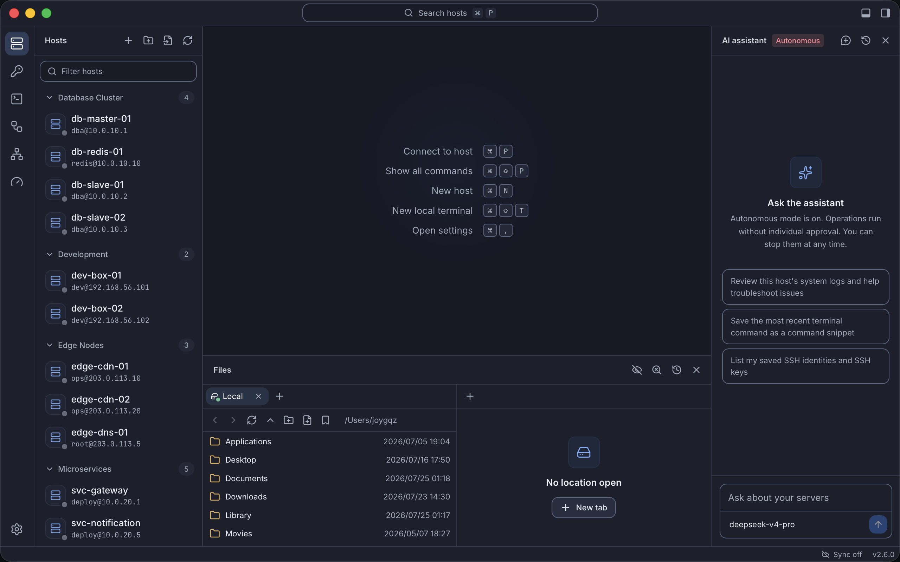

<div align="center">


# Sageport

**你的所有服务器，一个工作台。**

终端、文件传输、状态监控、端口转发、定时自动化——装进一个免费开源的桌面应用，只靠标准 SSH 协议。

[](https://github.com/joygqz/sageport/releases/latest)
[](LICENSE)
[](https://tauri.app)

[English](README.md) · 简体中文

</div>



## 为什么选 Sageport

管服务器往往意味着一堆工具：这边一个终端，那边一个 SFTP 客户端，某台机器上跑着 cron 脚本，备忘录里存着常用命令，还有一个不太放心的密钥管理器。Sageport 把这些全部收进一个 VS Code 风格的工作台。

| 你正在来回切换的…        | Sageport 给你的                          |
| ------------------------ | ---------------------------------------- |
| 每台服务器开一个终端     | 多标签、分屏，还能向多台服务器广播输入   |
| 单独的 SFTP 客户端       | 双栏文件浏览器，拖拽即传、远程直接编辑   |
| 部署脚本和 cron 任务     | 可视化任务编排，支持定时、重试、运行历史 |
| SSH 上去跑 `htop`        | CPU、内存、磁盘、网络实时图表，免探针    |
| 存满命令的备忘录         | 带变量的命令片段，可跨多台主机批量执行   |
| 背不下来的 `ssh -L` 参数 | 一键启停的端口转发，还能自动拉起         |

三条原则贯穿始终：

- **服务器上什么都不用装。** Sageport 只说标准 SSH 和 SFTP，`ssh` 能连上的地方它就能用。
- **本地优先。** 没有账号，没有云服务，主机、密钥、历史、设置都存在你自己设备的数据库里。
- **决定权在你。** 陌生主机指纹、危险操作、AI 的每一步动作，都先问过你再执行。

## 功能导览

### 终端

多标签加分屏、断线一键重连、回滚搜索、命令自动补全。广播模式把输入同时敲进每一个已连接的终端，批量改配置正合适。赶时间的话，在命令面板输入 `user@host` 即连，什么都不用保存。

### 文件传输

双栏浏览器把本机和服务器摆在一起：拖拽即传，大目录即输即筛、随手排序；远程文件在带语法高亮的 Monaco 编辑器里直接改，保存即回写服务器。递归删除先扫描、再并行执行、进度实时可见，超大目录也不在话下。每一次传输都留有两端完整记录。

### 自动化

把步骤串成任务：本地构建、上传产物、重启服务——每一步可以是本地命令、上传、下载或远程命令。可以从模板起步（前端发布、后端发布、数据库备份、配置下发、日志收集），也可以从零编排。易失败的步骤配上自动重试，每一步的输出实时可看，每一次运行都进入持久化历史，随时回查。

给任务加上 cron 定时，它就会自己运行。关掉窗口也不会中断：Sageport 缩进系统托盘继续工作，托盘菜单里即将运行的任务和活跃的端口转发一目了然。

### 主机与凭据

按你自己的方式给主机分组，用可复用的身份在多台主机间共享登录凭据，通过跳板机链路直达堡垒机之后的内网机器。`~/.ssh/config` 里已有的主机一步导入。SSH 密钥的生成、导入、管理都在应用内完成。

### 监控

对任意已连接的主机打开监控，就能看到 CPU、内存、磁盘、网络的实时图表——数据走的是现有 SSH 会话，什么都不用部署。

### 片段与批量执行

把反复敲的命令存下来，用 `{{变量}}` 占位、运行时填空。一条片段可以跑在一台主机上，也可以同时跑在多台上，输出和状态按主机分开呈现。

### 端口转发

本地、远程、动态（SOCKS）三种转发，定义一次、点击即用，跳板机之后照样通。设为自动启动后，数据库客户端和内网面板随时可达。

### AI 助手

接入你自己的服务——任何兼容 OpenAI 或 Anthropic 接口的端点都行。助手能查看工作台、建议并执行命令、管理文件，还能替你编排自动化任务。它遵循严格的确认模型：读取终端或远程文件内容永远需要你同意，其余操作默认等你放行；即便开启自主模式，接触过不可信内容后也会重新暂停。

### 同步与备份

可选地在多台设备之间同步配置，支持 GitHub Gist、Google Drive、OneDrive、WebDAV 和 S3——数据在离开设备前就用你的密码短语加密。想完全离线？导出一份加密备份文件即可。

### 工作台

一个命令面板通达所有功能，全程快捷键操作，明暗主题，简体中文和英文界面，还有带 Schema 校验的 JSON 设置编辑器，留给更喜欢敲配置的你。

## 安装

从[最新版本](https://github.com/joygqz/sageport/releases/latest)下载：

| 平台                            | 安装包                         |
| ------------------------------- | ------------------------------ |
| macOS（Apple Silicon 与 Intel） | 通用 `.dmg`                    |
| Windows（64 位）                | `.exe` 安装程序或便携版 `.zip` |
| Linux（64 位）                  | `.AppImage` 或 `.deb`          |

安装版会自动更新，新版本直接在应用内完成安装。

**便携模式（Windows）。** 便携版 `.zip` 无需安装：解压到任意位置（U 盘也行）即可运行，所有设置、主机、密钥与记录都在 `Sageport.exe` 旁边的 `data` 目录里。目录搬到哪儿，整套配置就跟到哪儿。便携版不会自动更新、不注册开机自启；拿到该目录的人就能读取其中的凭据，请保管好磁盘本身。

## 快速上手

1. **添加服务器。** 按 <kbd>⌘</kbd> <kbd>N</kbd> 填入地址、用户名和密码或密钥——或者把 `~/.ssh/config` 里的主机一次性导入。
2. **连接。** 在侧边栏点击主机，或按 <kbd>⌘</kbd> <kbd>P</kbd> 输入名称。
3. **传文件。** 按 <kbd>⌘</kbd> <kbd>J</kbd>，在两栏之间拖拽文件。
4. **自动化一件事。** 打开任务视图，选个模板，指定主机，运行。跑顺了就加上定时，交给托盘接管。

Windows 和 Linux 上，把 <kbd>⌘</kbd> 读作 <kbd>Ctrl</kbd>。

## 常见问题

**服务器上需要装什么吗？**
不需要。Sageport 使用标准 SSH 和 SFTP，监控也只是在现有会话上运行普通命令。

**我的数据存在哪里？**
存在你设备上的本地数据库里。没有 Sageport 云服务，也没有账号。注意：密码和密钥在该数据库中未加密存储——能读你用户文件的程序就能读到它们，请保护好设备本身。

**应用关掉后定时任务还会跑吗？**
只要 Sageport 在运行——无论窗口打开还是缩在托盘——任务就会按时执行。关闭窗口只是收进托盘，定时照常；从托盘菜单退出才会全部停止。无论哪种情况，每次运行都记录在本地。

**同步密码短语忘了能找回吗？**
不能。备份在上传前就用你的密码短语加密，存储服务商看不到它，开发者也无法恢复。请另行妥善保存一份。

**支持哪些 AI 服务？**
任何兼容 OpenAI 或 Anthropic API 的端点，商业服务或自建都可以。你提供 base URL、密钥和模型；除非你让助手去看，你的服务器信息不会被发往任何地方，而读取终端或文件内容永远需要你确认。

## 从源码构建

需要 [Node.js](https://nodejs.org) 与 [pnpm](https://pnpm.io)、[Rust 工具链](https://rustup.rs)，以及对应平台的 [Tauri 2 前置依赖](https://tauri.app/start/prerequisites/)。

```sh
pnpm install
pnpm tauri dev     # 开发模式运行
pnpm tauri build   # 打包发布版本
```

`pnpm test` 运行前端测试；在 `src-tauri` 目录下 `cargo test` 运行后端测试。

技术栈：Rust 内核（russh、sqlx + SQLite、tokio）加 React 19 + TypeScript 工作台（xterm.js、Monaco、Tailwind），由 Tauri 2 打包。

## 许可证

[GPL-3.0-only](LICENSE)
